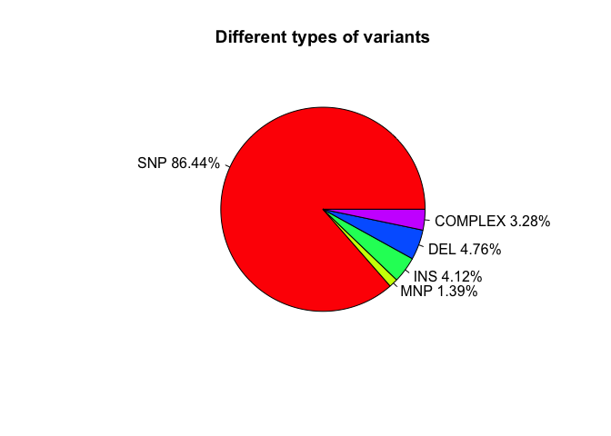
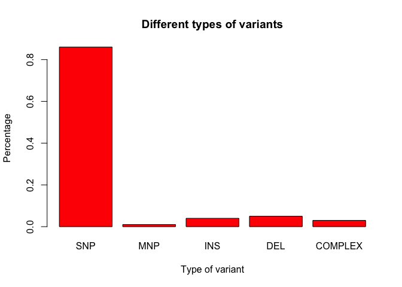
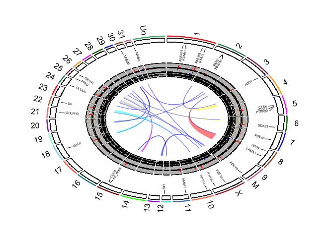
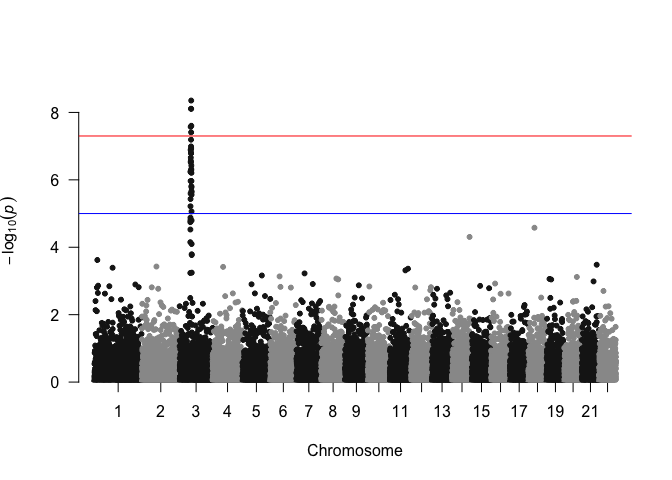
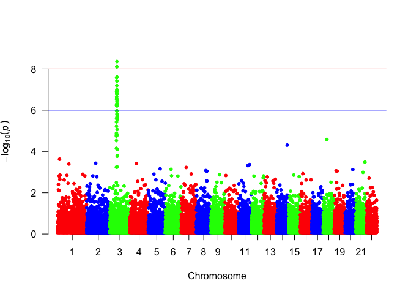

Variant plotting in R - Some introductory materials
========================================================


# Pie and Bar charts for SNP types

First of all, we are going to generate plots to show the composition of different types of variants.

Freebayes produces 4 different types of variants using TYPE= in the info field. The four types are mnp, ins, del, and complex. We can extract the counts of the diffent types using a program called egrep 

```
egrep -c "TYPE=mnp" filtered.vcf
```

Use the same command to get the number of ins, del and complex types. Verify the sum of the types equals the total number of SNPs in the file.

## 1. simple pie chart
The number of SNPs, MNPs, INS, DELs, and COMPLEX in the list of filtered variants by Freebayes (QUAL > 60).

```r
slices <- c(8539874, 137816, 407312, 470210, 324538)
labels <- c("SNP", "MNP", "INS", "DEL", "COMPLEX")
pct <- round(slices/sum(slices)*100, digits=2)
labels <- paste(labels, pct)
labels <- paste(labels, "%", sep="")
pie(slices, labels=labels, col=rainbow(length(labels)), main="Different types of variants")
```

<!-- -->

## 2. histogram plot of the data above

```r
variants <- round(slices/sum(slices), digits=2) # turn the raw counts into proportions
names(variants) <- c("SNP", "MNP", "INS", "DEL", "COMPLEX")
barplot(variants, col="red", main="Different types of variants", xlab="Type of variant", ylab="Percentage")
```

<!-- -->

## 3. Pie and historgram 
Now do the same thing but for the snpeff annotations, use the key search phrases in grep "prime_UTR", "inframe_insertion", "frameshift", "intergenic", "intron", "missense", "splice_", "stop_lost", "synonymous", "_gene_variant" [combined upstream/downstream gene variants].

# circos plots 
## 1. Now, we are going to use a package "RCircos" to generate circos plot.
First, install RCircos if haven't done it already 


```r
#source("http://bioconductor.org/biocLite.R")
#biocLite("RCircos")
#biocLite("IdeoViz")
library(IdeoViz)
library(RCircos)
```

Download cytoband ideogram data from UCSC using package IdeoViz.

```r
ideo <- getIdeo("equCab2")
```

Set up RCircos core components. One may plot both to the inside and outside of the ideogram track. Today, we are going to only plot tracks in the inside of the ideogram.

```r
chr.exclude <- NULL
cyto.info <- ideo
tracks.inside <- 10
tracks.outside <- 0
RCircos.Set.Core.Components(cyto.info, chr.exclude, tracks.inside, tracks.outside)
```

```
## 
## RCircos.Core.Components initialized.
## Type ?RCircos.Reset.Plot.Parameters to see how to modify the core components.
```

```r
# plot ideogram
RCircos.Set.Plot.Area()
```

<!-- -->

```r
par(mai=c(0.25, 0.25, 0.25, 0.25));
plot.new();
plot.window(c(-2.5,2.5), c(-2.5, 2.5));
RCircos.Chromosome.Ideogram.Plot()

# plot gene labels, there are limits setup by default for the number of genes that can be plotted for each chromosome based on the size of the chromosomes. The parameter can be changed if necessary. However, plotting too many genes will have the risk of having gene symbols overlapping one another.

# First download the gene annotation files 'ensGene.txt' and 'ensemblToGeneName.txt' from UCSC http://hgdownload.cse.ucsc.edu/goldenPath/equCab2/database/ 
genes <- read.table(file="ensGene.txt", sep="\t", header=F, stringsAsFactors=F)
anno <- read.table(file="ensemblToGeneName.txt", sep="\t", header=F, stringsAsFactors=F)
idx <- match(genes$V2, anno$V1)
genes$anno <- unlist(lapply(1:dim(genes)[1], function(x){if (is.na(idx[x]) == "TRUE") {genes$V2[x]} else {anno$V2[idx[x]]}}))

# write out the gene label anntation file
write.table(genes[,c("V3","V5","V6","anno")], file="gene.label", sep="\t", row.names=F, col.names=F, quote=F)

gene.label.data <- read.table(file="gene.label", sep="\t", header=F)

# The format of the gene information:

head(gene.label.data)
```

```
##     V1     V2     V3                   V4
## 1 chr1  11192  15975                SYCE1
## 2 chr1  29518  67141 ENSECAT00000018774.1
## 3 chr1  29524  71177 ENSECAT00000018811.1
## 4 chr1 132226 143850               CYP2E1
## 5 chr1 171785 172706 ENSECAT00000004254.1
## 6 chr1 183830 184742 ENSECAT00000004598.1
```

```r
# The column names of gene information should be set as following.

colnames(gene.label.data) <- c("Chromosome", "chromStart", "chromEnd", "Gene")

# Create a subset of gene list. first remove genes that do not have gene symbols, because ENSEMBL IDs are too long in character and will use up too much space for demonstration purpose. The list of genes would be the genes of interest. In the class, we will randomly select 30 genes.

tmp.list <- gene.label.data[-grep("ENSECAT", gene.label.data$Gene),]
idx <- sample(1:dim(tmp.list)[1], 30, replace=F)
gene.list <- tmp.list[idx,]
name.col <- 4
side <- "in"
track.num <- 1
RCircos.Gene.Connector.Plot(gene.list, track.num, side)
```

```
## There is unsupported chromosome names in ideogram
## and chromosomes are sorted in alphabetical order.
```

```
## Not all labels will be plotted.
```

```
## Type RCircos.Get.Gene.Name.Plot.Parameters()
```

```
## to see the number of labels for each chromosome.
```

```r
track.num <- 2
RCircos.Gene.Name.Plot(gene.list, name.col, track.num, side)
```

```
## There is unsupported chromosome names in ideogram
## and chromosomes are sorted in alphabetical order.
```

```
## Not all labels will be plotted.
```

```
## Type RCircos.Get.Gene.Name.Plot.Parameters()
```

```
## to see the number of labels for each chromosome.
```

```r
# It's possible that some genes are not plotted because of the limit of plotting for each chromosome.

# check plot parameters, if needed, they may be changed.
RCircos.Get.Gene.Name.Plot.Parameters() 
```

```
##    chromosomes maxLabels startLoc endLoc labelWidth
## 1         chr1        12        1   6195        500
## 2         chr2         8     6495  10523        500
## 3         chr3         7    10823  14806        500
## 4         chr4         7    15106  18725        500
## 5         chr5         6    19025  22348        500
## 6         chr6         5    22648  25471        500
## 7         chr7         6    25771  29056        500
## 8         chr8         6    29356  32491        500
## 9         chr9         5    32791  35577        500
## 10        chrM         0    35877  35877        500
## 11        chrX         8    36177  40315        500
## 12       chr10         5    40615  43414        500
## 13       chr11         4    43714  45758        500
## 14       chr12         2    46058  47161        500
## 15       chr13         2    47461  48880        500
## 16       chr14         6    49180  52310        500
## 17       chr15         6    52610  55662        500
## 18       chr16         5    55962  58875        500
## 19       chr17         5    59175  61866        500
## 20       chr18         5    62166  64917        500
## 21       chr19         3    65217  67217        500
## 22       chr20         4    67517  69655        500
## 23       chr21         3    69955  71880        500
## 24       chr22         3    72180  73844        500
## 25       chr23         3    74144  76002        500
## 26       chr24         3    76302  77860        500
## 27       chr25         2    78160  79478        500
## 28       chr26         2    79778  81174        500
## 29       chr27         2    81474  82806        500
## 30       chr28         3    83106  84645        500
## 31       chr29         2    84945  86067        500
## 32       chr30         2    86367  87370        500
## 33       chr31         1    87670  88502        500
## 34       chrUn         7    88802  92718        500
```

```r
# add extra tracks -- Histogram plot of CNV data. Any extra track will depend on the types of data one wants to include in the plot. The required information is the location of what will be plotted in the genome: chromosome number, start and stop position.
gene.list$CNV <- floor(runif(n=30, min=1, max=7))
data.col <- 5 # the CNV column
track.num <- 5
side <- "in"
RCircos.Histogram.Plot(gene.list, data.col, track.num, side, is.sorted=FALSE, min.value=-2)


# add extra tracks -- Scatter plot of RNASeq results
gene.expr <- gene.list
colnames(gene.expr)
```

```
## [1] "Chromosome" "chromStart" "chromEnd"   "Gene"       "CNV"
```

```r
colnames(gene.expr) <- c("chromosome", "start", "stop", "gene.name", "CNV")

# generate random logFC data of 30 in length between -3 and 3
gene.expr$logFC <- runif(30, -3, 3)

# first three columns are required for plotting and one more column that corresponds to the data to plot 
head(gene.expr)
```

```
##       chromosome    start     stop gene.name CNV       logFC
## 26348       chr8 41149559 41172140     CLUL1   1 -1.51146016
## 15444      chr23 20989139 21021271     PTAR1   5  2.44360408
## 24054       chr6 84181611 84194476     CPSF6   6 -0.05571431
## 27577      chrUn 41707453 41737729      LSP1   5  2.71004014
## 18842       chr3 21787776 21818163    PMFBP1   6  2.99501280
## 11708       chr2 10017031 10047732     BEND5   6  0.86105879
```

```r
data.col <- 6
track.num <- 6
side <- "in"

# "by.fold" is a zero or positive number. If it's positive, then any data point with a value >= by.fold will be plotted as red color; any data point with a value <= -by.fold will be plotted as blue color; otherwise, data point will be plotted in black color.
by.fold <- 1.5

# plot scatter plot
RCircos.Scatter.Plot(gene.expr, data.col, track.num, side, by.fold, is.sorted=FALSE)

# add extra tracks -- Line plot of Coverage results

genome.cov <- gene.label.data[-grep("ENSECAT", gene.label.data$Gene),]
colnames(genome.cov) <- c("chromosome", "start", "stop", "gene.name")
genome.cov$logCOV <- rnorm(dim(genome.cov)[1], 0, 0.9)
data.col <- 5
track.num <- 7
side <- "in"
RCircos.Line.Plot(genome.cov, data.col, track.num, side, is.sorted=FALSE)

# add most inside track -- link lines and ribbons.

# generate random translocation variants data
link.data <- data.frame(Chromosome=character(), chromStart=integer(), chromEnd=integer(), Chromosome.1=character(), chromStart.1=integer(), chromEnd.1=integer(), stringsAsFactors=F)
for (i in 1:15) {
  n.rand <- floor(runif(1, 1,34))
  chrom <- ideo$chrom[n.rand]
  str <- floor(runif(1, ideo$chromStart[n.rand], ideo$chromEnd[n.rand]))
  ed <- floor(runif(1, ideo$chromStart[n.rand], ideo$chromEnd[n.rand]))
  n.rand <- floor(runif(1, 1, 34))
  chrom.1 <- ideo$chrom[n.rand]
  str.1 <- floor(runif(1, ideo$chromStart[n.rand], ideo$chromEnd[n.rand]))
  ed.1 <- str.1
  if (ed < str) {
    tmp <- ed
    ed <- str
    str <- tmp
  }
  link.data <- rbind(link.data, data.frame(Chromsome=chrom, chromStart=str, chromEnd=ed, Chromosome.1=chrom.1, chromStart.1=str.1, chromEnd.1=ed.1))
  i <- i + 1
}

track.num <- 9

# plot link lines
RCircos.Link.Plot(link.data, track.num, TRUE, is.sorted=FALSE)

# ribbon data
ribbon.data <- link.data
colnames(ribbon.data) <- c("chromA", "chromStartA", "chromEndA", "chromB", "chromStartB", "chromEndB")
RCircos.Ribbon.Plot(ribbon.data=ribbon.data, track.num=9, by.chromosome=FALSE, twist=FALSE, is.sorted=FALSE)
```

<!-- -->

# 4. GWAS data plotting
Install R package "qqman" if it hasn't been done. The develop version of the package can be installed from the source on github.

```r
#biocLite("devtools")
library(devtools)
install_github("stephenturner/qqman")
library(qqman)

# using the example data from qqman package
head(gwasResults)
```

```
##   SNP CHR BP         P
## 1 rs1   1  1 0.9148060
## 2 rs2   1  2 0.9370754
## 3 rs3   1  3 0.2861395
## 4 rs4   1  4 0.8304476
## 5 rs5   1  5 0.6417455
## 6 rs6   1  6 0.5190959
```

```r
manhattan(gwasResults)
```

<!-- -->

```r
# use colors for chromosomes
manhattan(gwasResults, col=c("red", "blue", "green"))
```

<!-- -->

```r
# change default horizontal line position
manhattan(gwasResults, suggestiveline=-log10(1e-6), genomewideline=-log10(1e-8), col=c("red", "blue", "green"))
```

<!-- -->

