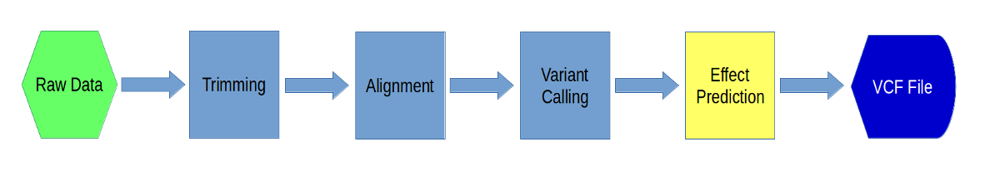

Effect Prediction using SnpEff
===============================

In this section we will be using a software called 'snpeff' to do effect prediction of our variants. We will build an effect prediction database using our reference and annotation and then use that database to run effect prediction. This will give us a VCF file with an extra "ANN" field per variant, which will give us the effect of that variant.

---

**1\.** As before, let's create a directory for this section:

    cd ~/variant_example
    mkdir 05-snpeff
    cd 05-snpeff

And let's link in our variant file from our freebayes run:

    ln -s ../03-freebayes/freebayes.chr18.all.vcf

---

**2\.** Normally we would use the snpeff module to run snpeff, but in this case, since we want to create our own database, we need to download our own instance of snpeff. Go to the [SnpEff sourceforge page](http://snpeff.sourceforge.net/SnpEff_manual.html) to look at the documentation. Use 'wget' to get the source code to your 05-snpeff directory:

    wget https://downloads.sourceforge.net/project/snpeff/snpEff_latest_core.zip

Unzip the file:

    unzip snpEff_latest_core.zip
    
Look at the directories created and then go into the 'snpEff' directory:

    ls -ltrh
    cd snpEff 

---

**3\.** Now go back to the [snpeff documentation](http://snpeff.sourceforge.net/SnpEff_manual.html) and click on the "Building Databases" section. We will be following directions from this section. First, we need to add lines to the snpeff configuration file. Use nano to open the file:

    nano snpEff.config

And then add the following lines to the file in the "Non-Standard Databases" section:

\# chr18

chr18.genome : chr18

Save the file and Exit nano.

---

**4\.** Next we need to make directories where the database will reside:

    mkdir data
    mkdir data/chr18 
    cd data/chr18

Now, link to the reference file, but call it "sequences.fa":

    ln -s ~/variant_example/ref/chr18.fa sequences.fa

And get the annotation file:

    wget https://raw.githubusercontent.com/ucdavis-bioinformatics-training/2017-August-Variant-Analysis-Workshop/master/thursday/chr18.gtf

Change its name to 'genes.gtf':

    mv chr18.gtf genes.gtf

---

**5\.** We are ready to create the database. Go back to the snpEff directory and run the 'build' command for snpeff:

    cd ../..
    java -jar snpEff.jar build -gtf22 -v chr18

Now we're ready to do effect prediction.

---

**6\.** Go back to your '05-snpeff' directory and look at the options for the effect prediction command for snpeff:

    cd ..
    java -jar snpEff/snpEff.jar eff -h

Now run the prediction:

    java -jar snpEff/snpEff.jar eff chr18 freebayes.chr18.all.vcf > snpeff.chr18.vcf

This will take about 8 minutes to run.

---

**7\.** Take a look at the output file:

    less snpeff.chr18.vcf

Also, download (to your laptop) and take a look at the 'snpEff_summary.html' file. The VCF file is the same file as the input, except every variant has an 'ANN' field added to it. Look at the [snpeff docs](http://snpeff.sourceforge.net/SnpEff_manual.html#input) and [this detailed pdf](http://snpeff.sourceforge.net/VCFannotationformat_v1.0.pdf) to get information about the format of the 'ANN' field.

---

**8\.** The next step is to filter our variants. To do that we will use 'snpsift'i, which is part of the snpeff package. SnpSift allows you to filter a VCF file on any of the fields, filter based on specific sample genotypes, as well as many other things. First take a look at the options for SnpEff:

    java -jar snpEff/SnpSift.jar -h

Also, take a look at the [filter documentation for SnpSift](http://snpeff.sourceforge.net/SnpSift.html#filter). The filter command takes an arbitrary expression for filtering. Let's try a few. First, let's count the number of variants in our file:

    cat snpeff.chr18.vcf | grep -v ^# | wc -l

This command looks for all the lines that do NOT start with a "#" (i.e. everything but comment lines) and counts them.

---

**9\.** Here how to keep variants that have a quality above 30:

    java -jar snpEff/SnpSift.jar filter "QUAL >= 30" snpeff.chr18.vcf | less

Now let's count them:

    java -jar snpEff/SnpSift.jar filter "QUAL >= 30" snpeff.chr18.vcf | grep -v ^# | wc -l

The count will be lower than before. Try different values for QUAL and see the reduction in the number of variants.

---

**10\.** Let's say we wanted also wanted at least 3 samples to have homozygous genotypes:

    java -jar snpEff/SnpSift.jar filter "( countHom() >= 3 ) & (QUAL >= 30)" snpeff.chr18.vcf | less

You may need to \<Ctrl\>-C out of the 'less'. The "&" symbol is a boolean 'AND' operator, which means that the entire expression is true if and only if both of the tests are true. There is also a boolean 'OR' operator:

    java -jar snpEff/SnpSift.jar filter "((countHom() >= 3) & (QUAL >= 30)) | (DP>=50)" snpeff.chr18.vcf | less

The expression obeys the standard parentheses grouping rules. So what does the above command do?

---

**11\.** Compare this file with the file we got from GATK:

    grep -v ^# snpeff.chr18.vcf | wc -l
    grep -v ^# ../04-gatk/all.chr18.vcf | wc -l

Are the number of variants the same? If not, why not? Also, we can use 'bedtools' to look at the intersection (bedtools will work on BED as well as VCF format files):

    module load bedtools
    bedtools intersect -a snpeff.chr18.vcf -b ../04-gatk/all.chr18.vcf | wc -l

This gives you the number of variants that intersect between the two.

---

**12\.** In the next step, we will keep only those variants that have a 'missense' effect. In order to do that we access the "ANN" field and look for 'missense'. The "ANN" field can have annotation for multiple effects, so each effect annotation is designated by a number, starting at 0 (i.e. ANN[0], ANN[1], etc.). However, if you want to search every annotation, you can use the "\*" wildcard. Also, instead of using an "=" we use the word "has" because even within the effect you can have multiple values:

    java -jar snpEff/SnpSift.jar filter "ANN[*].EFFECT has 'missense_variant'" snpeff.chr18.vcf | less

Count them:

    java -jar snpEff/SnpSift.jar filter "ANN[*].EFFECT has 'missense_variant'" snpeff.chr18.vcf | grep -v ^# | wc -l

---

**13\.** You can also extract specific fields from a vcf file. Any of the fields on a line can be extracted. For example:

    java -jar snpEff/SnpSift.jar extractFields snpeff.chr18.vcf CHROM POS ANN[*].EFFECT | less

will extract the chromosome, position, and effect for every variant.

---

**14\.** Now, let's take a look at the file that delly produced. Let's see if we can find the deletion from the paper. First, link in the file:

    ln -s ../03-freebayes/delly.chr18.all.vcf

Now, in our example, sample A8100 is the diseased sample and the rest are controls. So, we want to find a deletion that occurs in A8100 and NOT in the others. We can filter based on genotypes using "GEN". So, for example:

    java -jar snpEff/SnpSift.jar filter "isVariant(GEN[0])" delly.chr18.all.vcf | less

will look for any variants that occur in the first sample (1st sample is 0, 2nd sample is 1, etc.). This command:

    java -jar snpEff/SnpSift.jar filter "isVariant(GEN[0]) & isHom(GEN[0]) & FILTER='PASS'" delly.chr18.all.vcf | less

will look for any variants that occur in the first sample AND are homozygous AND where the FILTER column has a value of 'PASS' (like we did with 'awk' after using delly). Finally, try to construct the expression you would need to find the deletion we are looking for. You will need to use 'isRef' to test for samples that genotype reference.

If you are unable to get it, [click here](command.txt) to see the command.

---

**13\.** You will see that there is only one variant left after the command. This is the variant from the paper. To verify it, redirect the output of the command to a file and then extract the chromosome, position, and end information using 'extractFields'. Go back to IGV, load up the alignment tracks, and go to that position. You should see the deletion that we looked at earlier in the week. Finally, earlier we used the annotation file to create our effect database.... download that file to your laptop and load it into IGV. You should see the HOXD3 gene downstream of the deletion region.
