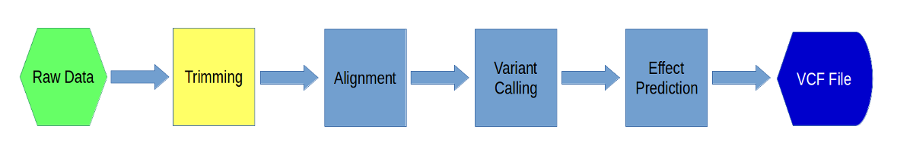

Preprocessing Data
===================

In this exercise, we will learn how to preprocess our data for alignment. We will be doing adapter trimming and quality trimming. First we will remove adapters from our raw sequences and then we will trim sequences with low quality.

---

**1\.** First, create a directory for the example in your home directory:

    cd
    mkdir variant_example

---

**2\.** Next, go into that directory and link to the directory for your raw data. This data comes from a project to find variation in horses:

    cd variant_example
    ln -s /share/biocore/workshops/Variant-Analysis-Workshop/00-RawData

---

**3\.** Now, take a look inside that directory.

    cd 00-RawData
    ls

--- 

**4\.** You will see a list of directories and some other files. Take a look at all the files in all of the directories:

    ls *

---

**5\.** Pick a directory and go into it. Look at one of the files using the 'less' command:

    cd A8100
    less A8100.chr18.R1.fastq

Make sure you can identify which lines correspond to a single read and which lines are the header, sequence, and quality values. Press 'q' to exit this screen. Then, let's figure out the number of reads in this file. A simple way to do that is to count the number of lines and divide by 4 (because the record of each read uses 4 lines). In order to do this, use "cat" to output the file and pipe that to "wc" to count the number of lines:

    cat A8100.chr18.R1.fastq | wc -l

Divide this number by 4 and you have the number of reads in this file. One more thing to try is to figure out the length of the reads without counting each nucleotide. First get the first 4 lines of the file (i.e. the first record):

    cat A8100.chr18.R1.fastq | head -4

Then, copy and paste the sequence line into the following command (replace [sequence] with the line):

    echo -n [sequence] | wc -c

This will give you the length of the read. See if you can figure out how this command works.

---

**6\.** Now go back to your 'variant_example' directory and create another directory called '01-Trimming':

    cd ~/variant_example
    mkdir 01-Trimming

---

**7\.** Go into that directory (make sure your prompt shows that you are in the 01-Trimming directory) and link to all of the files you will be using:

    cd 01-Trimming
    ln -s ../00-RawData/*/*.fastq .
    ls -l

Now you should see a long listing of all the links you just created.

---

**8\.** Before we do any trimming, let's run a quality control check on one of the files. To do this, we will use a piece of software called 'FastQC'. Load the module and check out the usage & options:

    module load fastqc
    fastqc -h

FastQC creates html output that has graphics with quality control analysis. You'll need to create an output directory first and then run fastqc:

    mkdir fastqc_out
    fastqc -t 4 -o fastqc_out A8100.chr18.R1.fastq

When that is done, you will need to download the fastqc_out directory to your laptop and then use a browser look at the html file in it. We will go over the contents of the output in class.

---

**9\.** Now, we will use software called 'scythe' (developed at the UC Davis Bioinformatics Core) to do adapter trimming. First we will run it on just one pair of files. First, load the module, and then type 'scythe' with no arguments to see the options.

    module load scythe
    scythe

Looking at the Usage you can see that scythe needs an adapter file and the sequence file. The adapter file will depend upon which kit you used... typically you can find the adapters from the sequencing provider. In this case, Illumina TruSeq adapters were used, so we have put the adapters (forward & reverse) in a file for you already ([adapters file](adapters.fasta)). You will have to use the "wget" command to copy the file to your class directory:

    wget https://ucdavis-bioinformatics-training.github.io/2017-August-Variant-Analysis-Workshop/tuesday/adapters.fasta

Now run scythe specifying an output file, the adapters file, and the input file. Add an ampersand at the end to run it in the background so that we can run the other file through scythe concurrently:

    scythe -o A8100.chr18.R1.scythe.fastq -a adapters.fasta A8100.chr18.R1.fastq &
    scythe -o A8100.chr18.R2.scythe.fastq -a adapters.fasta A8100.chr18.R2.fastq &

This will take approximately 5 minutes to run. You can use the 'top' or 'jobs' commands to monitor the jobs. When the jobs finish, you will have two files that are adapter trimmed.

---

**10\.** Once that is done, let's take a look at the differences between the input and output files. First look at the input file:

    less A8100.chr18.R1.fastq

Let's search for the adapter sequence. Type '/' (a forward slash), and then type **AGATCGGAAGAGCACACGTCTG** (the first part of the forward adapter). Press Enter. This will search for the sequence in the file and highlight each time it is found. You can now type "n" to cycle through the places where it is found. When you are done, type "q" to exit. Now look at the output file:

    less A8100.chr18.R1.scythe.fastq

If you scroll through the data (using the spacebar), you will see that some of the sequences have been trimmed. Now, try searching for **AGATCGGAAGAGCACACGTCTG** again. You shouldn't find it. You may need to use Control-C to get out of the search and then "q" to exit the 'less' screen.

---

**11\.** Now we will trim for low quality using a program called 'sickle' (also developed at the Core). First, load the module and type 'sickle' by itself to get the usage, and then 'sickle pe' to get the usage for paired-end reads.

    module load sickle
    sickle
    sickle pe

Our reads are paired-end reads in separate files, so we will be using the "-f", "-r", "-o", and "-p" options. Remember that you will be using the scythe output files as input to this step.

    sickle pe -f A8100.chr18.R1.scythe.fastq -r A8100.chr18.R2.scythe.fastq -o A8100.chr18.R1.sickle.fastq -p A8100.chr18.R2.sickle.fastq -s A8100.chr18.singles.fastq -t sanger

This will take about 5 minutes to run. If you look through the output files, you will see reads trimmed for low quality. Sickle produces three files, two paired-end quality trimmed files, and a singles file where reads are kept where only one of the pair passed the thresholds. Sickle will output information about how many records it started with and how many were kept/discarded.

---

**12\.** We have run through adapter & quality trimming for one pair of files, but now we need to do it for all the files. For that we will be using the power of our cluster. You'll need to download the [qa.sh](qa.sh) cluster script:

    wget https://ucdavis-bioinformatics-training.github.io/2017-August-Variant-Analysis-Workshop/tuesday/qa.sh

Take a look at the script:

    cat qa.sh

This script is pretty much the same as the slurm.sh script you saw earlier.

---

**13\.** Now, let's run the script on all of our samples. First, make sure the script is executable:

    chmod a+x qa.sh
    
Run the script using 'sbatch' on rest of the samples:

    sbatch qa.sh A9004
    sbatch qa.sh A9006
    sbatch qa.sh A9014
    sbatch qa.sh A9018

Now you can use 'squeue' to make sure your jobs are queued properly. Now, all you have to do is wait.
