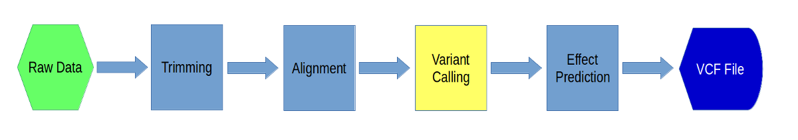
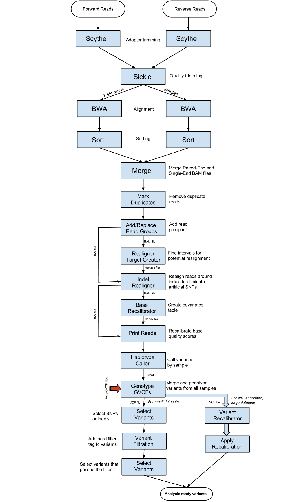

Variant Discovery using GATK3
=============================

In this section, we are going to run [GATK](https://software.broadinstitute.org/gatk/) (Genome Analysis Toolkit). GATK was created by the Broad Institute for variant analysis and genotyping primarily for the human genome. However, it certainly can be used for any genome.

---

GATK steps
----------

-----

**1\.** First, make a directory for this section in your variant_example directory:

    mkdir 04-gatk
    cd 04-gatk

Now, link in the files that we will be using. We have already done the alignment, so we will start with the BAM files from the final alignment step (as well as their indices):

    ln -s ../02-Alignment/*.all.bam .
    ln -s ../02-Alignment/*.all.bam.bai .

---

**2\.**. At this point, we have generated bam files that contain all the alignment information for the downstream analysis. But we have to get rid of duplicates. This step will be carried out using one of the Picard tools that is called "MarkDuplicates". First load the picard-tools module and look at the usage and available sub-commands:

    module load picard-tools
    picard -h

Now take a look at the long-form help output for MarkDuplicates (using the -H option):

    picard MarkDuplicates -H

We will set the validation stingency to "lenient" so that multimappers with zero mapping quality don't cause errors. Also set "assume sorted" to true because we already sorted the files in our alignment step. For now, we will work on only one of the samples:

    picard MarkDuplicates VALIDATION_STRINGENCY=LENIENT \
    AS=true REMOVE_DUPLICATES=true I=A8100.chr18.all.bam \
    O=A8100.chr18.markdup.bam M=A8100.chr18.metrics

Two output files will be generated by this step. One of them is a BAM file which is going to be the input for next step.

-----

**3\.**. Before we go into GATK, there is some information that needs to be added to the BAM file, using "AddOrReplaceReadGroups". To your marked duplicates BAM file, we will add **A8100** as "Read Group ID", "Read Group sample name" and "Read group library". "Read group platform" has to be **illumina** as the sequencing was done using an Illumina instrument. "Read group platform unit" we are going to set as **run**::

    picard AddOrReplaceReadGroups VALIDATION_STRINGENCY=LENIENT \
    I=A8100.chr18.markdup.bam O=A8100.chr18.rg.bam \
    RGID=A8100 RGLB=A8100 RGPL=illumina RGPU=run RGSM=A8100

And index the resulting BAM file so that downstream software can easily navigate the BAM file::

    module load samtools
    samtools index A8100.chr18.rg.bam

-----

**4\.** In the next step, we will start using GATK (Genome Analysis Tool Kit). In order to do so, we need to index the reference in two other ways:

    cd ../ref
    picard CreateSequenceDictionary R=chr18.fa O=chr18.dict
    samtools faidx chr18.fa
    cd ../04-gatk

Now load gatk:

    module load gatk

This sets a script in your path called "gatk" which will call the underlying gatk java file.

-----

**5\.** Now we are ready to use GATK. The first step in GATK variant discovery is to do indel realignment. These steps identify sites where artificial SNPs have been created due to the independent alignment of reads. These sites can then be locally realigned to produce a true indel rather than false SNPs. This set of sites that potentially need indel realignment is created using the command "RealignerTargetCreator". First take a look at the myriad of options across all of GATK as well as specifically to RealignerTargetCreator:

    gatk -T RealignerTargetCreator -h

On a system without modules you would use the full path of the java jar file to call gatk, like this::

    java -jar /software/gatk/3.8/static/GenomeAnalysisTK.jar -T RealignerTargetCreator -h

You should try looking at the help documentation for each of the GATK steps in this way as well as the GATK documentation links. Now, choose the output file from the Add Read Group step as the input BAM file. Your reference file is your indexed genome. Leave the rest of the parameters as they are.

    gatk -T RealignerTargetCreator \
    -nt 4 -R ../ref/chr18.fa -I A8100.chr18.rg.bam \
    -o A8100.chr18.intervals

This will produce a file with potential realignment sites.

-----

**6\.** At this point, we are ready to carry out the "IndelRealigner" step. Select the Add Read Group output as the input BAM file. Use the interval file generated from the previous step as the "target intervals":

     gatk -T IndelRealigner \
     -R ../ref/chr18.fa -I A8100.chr18.rg.bam \
     -targetIntervals A8100.chr18.intervals -o A8100.chr18.realigned.bam

-----

**7\.** After indel realignment, base quality needs to be recalibrated using "BaseRecalibrator". Basically, the quality scores are changed based upon machine cycle, sequence context, and any other covariates. This recalibration changes the quality scores so that the reported score is more accurate with respect to the probability of mismatching the reference genome. The output BAM file from the previous step is used as the input BAM file.  We will use the chr18.vcf "ROD" (Reference Ordered Data) file as our known sites. ROD files are merely the regular format of a file, except that they are in the same order, chromosomally, as the reference. GATK expects its known variant files to be ROD files. We will leave the other parameters as default. First download the vcf to your "ref" directory:

    cd ../ref
    wget https://raw.githubusercontent.com/ucdavis-bioinformatics-training/2017-August-Variant-Analysis-Workshop/master/wednesday/chr18.vcf
    cd ../04-gatk

Then, run BaseRecalibrator:

    gatk -T BaseRecalibrator \
    -I A8100.chr18.realigned.bam -R ../ref/chr18.fa \
    -knownSites ../ref/chr18.vcf \
    -o A8100.chr18.recal_data.grp

This step generates a covariates file. The covariates file is used in the next step to actually carry out the recalibration.

-----

**8\.** The recalibration step is carried out by the GATK command "PrintReads". Choose your covariate file generated by the previous step as the parameter to BQSR (Base Quality Score Recalibration). The input BAM is the BAM outputted from the Indel Realignment step:

    gatk -T PrintReads \
    -R ../ref/chr18.fa -I A8100.chr18.realigned.bam \
    -BQSR A8100.chr18.recal_data.grp \
    -o A8100.chr18.recalibrated.bam

-----

**9\.**. Now we are ready to do the initial per sample variant calling using "HaplotypeCaller". HaplotypeCaller first identifies regions of interest, determines haplotypes by local re-assembly of the regions, determines the likelihoods of the genotypes, and finally assigns sample genotypes. The input BAM file is the output BAM from the previous step. We will be outputting GVCF files using the -ERC option (Emit Reference Confidence). GVCF files are basically VCF files except with variant information for every position in the genome, regardless of whether there is a variant there or not. These GVCF files are used to make it easier to call genotypes across samples and also make it easier to add new samples into your experiment. However, this step can take a long time to run, so we want to run it in the background and using a command called 'nohup' that will allow the command to continue even after you log out. We will also redirect the info output to a file.

    nohup gatk -T HaplotypeCaller \
    -R ../ref/chr18.fa -ERC GVCF \
    -I A8100.chr18.recalibrated.bam -o A8100.chr18.g.vcf &> A8100.chr18.nohup &

Now this command is running in the background and will continue to run even if you log out. It will take about 4 hours to run. You can watch the progress using the 'tail' command:

    tail -f A8100.chr18.nohup

Use <Ctrl>-C to exit the tail command.

-----

**10\.** The next step is to run all of the previous commands on the rest of the samples. To do that we need to download a Slurm script:

    wget https://raw.githubusercontent.com/ucdavis-bioinformatics-training/2017-August-Variant-Analysis-Workshop/master/wednesday/gatk.sh

Change the permissions:

    chmod a+x gatk.sh

Take a look at it:

    cat gatk.sh

15. Now that we have generated our GVCF file, we need to run "GenotypeGVCFs" to join together multiple samples' GVCF files into one VCF file with aggregated genotype likelihoods and with re-annotation. Even though we only have one sample in this exercise, typically you will have more than one, in which case you would generate gVCFs for each sample using HaplotypeCaller separately and then specify all of the gVCFs on this command line using the "--variant" option multiple times. Since we only have one sample, we will only use the "--variant" option once. We will use our known SNPs file as dbsnp and use low thresholds for calling variants::

     gatk -T GenotypeGVCFs \
         -R CanFam3.1_chr1.fa -stand_call_conf 4 -stand_emit_conf 4 \
         --dbsnp CanFam3.1.79_chr1.known_variants.vcf \
         --variant reads.vs.canFam3.chr1.gvcf --out reads.vs.canFam3.chr1.vcf

  This will produce a regular VCF file which we will further filter in the following steps. Take a look at the file::

    less reads.vs.canFam3.chr1.vcf

-----

16. After the variant calling in the previous step, we will use "SelectVariants" to generate the output that only contains SNP variants. The input variant file should be the output from the previous step. Choose "SNP" as the selectType, which will get all variants that are SNPs::

     gatk -T SelectVariants \
         -R CanFam3.1_chr1.fa --variant reads.vs.canFam3.chr1.vcf -selectType SNP \
         -o reads.vs.canFam3.chr1.snps.vcf

  The variant file generated contains only the SNP variants called by GenotypeGVCFs.

-----

17. After the initial variant calling, a filter process needs to be done to generate a list of real variants using some type of criteria. Here we are using a set of criteria on the SNPs. We will use the "VariantFiltration" subprogram from GATK. The variant input file should be the SNP variant (VCF) file from the previous step. Our filter expression is **QD<2.0||MQ<40.0||FS>60.0||HaplotypeScore>13.0||MQRankSum<-12.5||ReadPosRankSum<-8.0**, which we get from looking at the GATK best practices for small datasets. The "double-pipe" (||) symbol is a logical OR, meaning that if any of those criteria are true then the variant will be tagged. Choose your canonical annotation file (CanFam3.1.79_chr1.known_variants.vcf) as the Mask ROD file and give the filter a name::

     gatk -T VariantFiltration \
         -R CanFam3.1_chr1.fa --variant reads.vs.canFam3.chr1.snps.vcf \
         --mask CanFam3.1.79_chr1.known_variants.vcf --filterName "snpsfilter" \
         --filterExpression "QD<2.0||MQ<40.0||FS>60.0||HaplotypeScore>13.0||MQRankSum<-12.5||ReadPosRankSum<-8.0" \
         --out reads.vs.canFam3.chr1.snps.tagged.vcf

  This step will tag the variants with a "snpsfilter" tag if they did not pass and a "PASS" tag if they did. It does **not** remove the variants that did not pass.
 
-----

18. After the filtration step, we need to further select only the variants that have passed the filter by running "SelectVariants" again. The input variant file is the output variant file from the previous step. Use **vc.isNotFiltered()** (including the parentheses) as the "select expression". This "select expression" was found by searching and reading help forums. Leave the other parameters as default::

     gatk -T SelectVariants \
         -R CanFam3.1_chr1.fa --variant reads.vs.canFam3.chr1.snps.tagged.vcf \
         -select 'vc.isNotFiltered()' -o reads.vs.canFam3.chr1.snps.filtered.vcf

  Now you have a file which contains SNPs which passed the filters. We can now use these for the next stage in our analysis, which is Effect Prediction.
